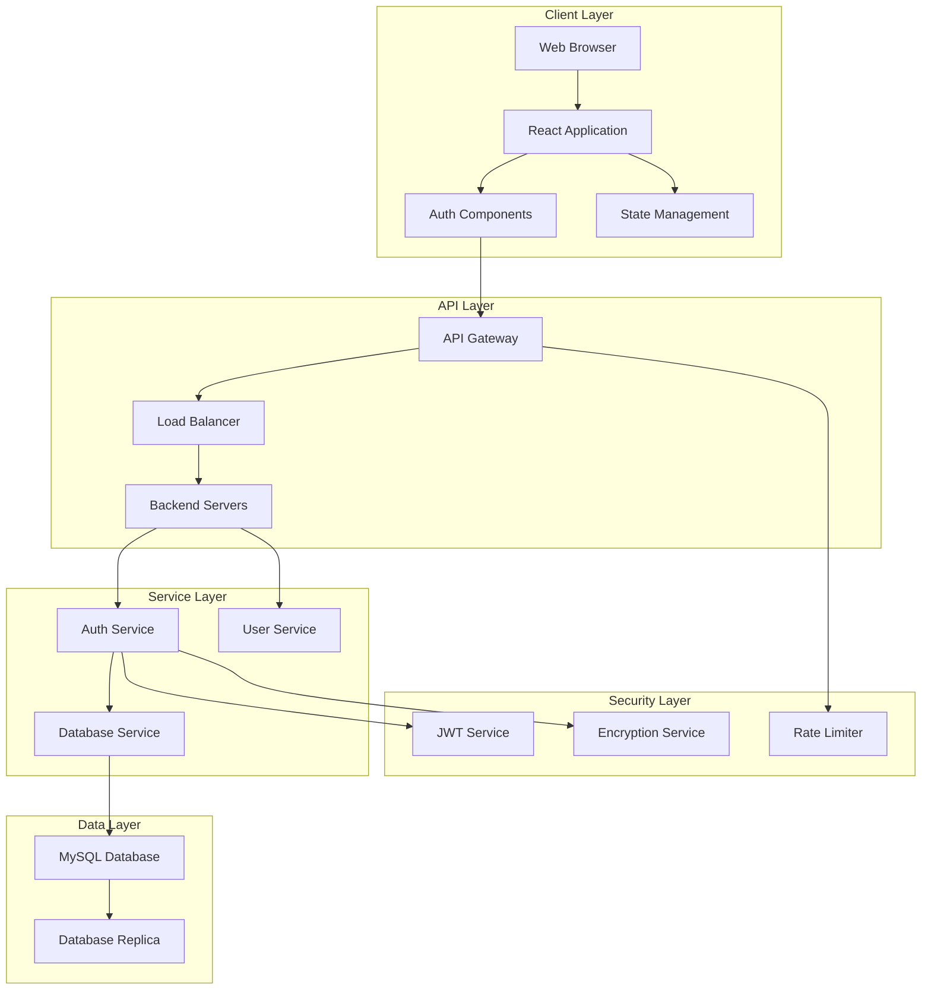
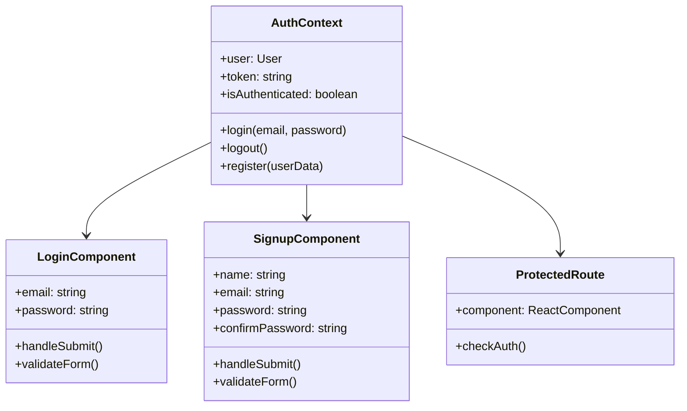
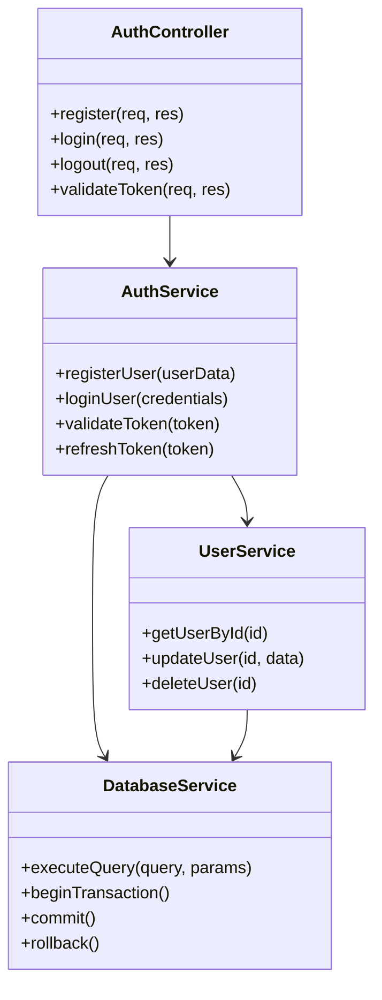
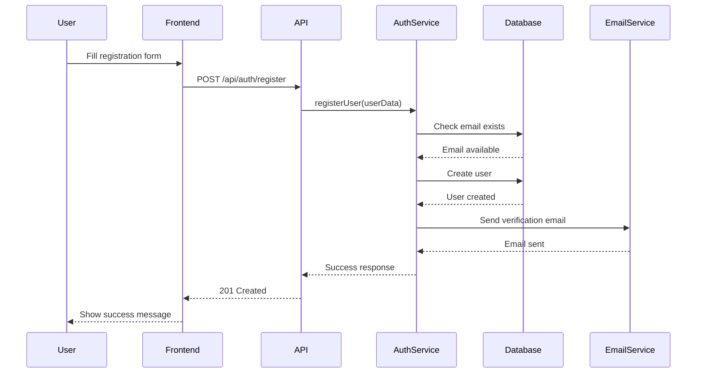
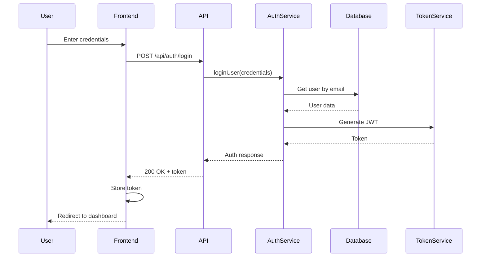
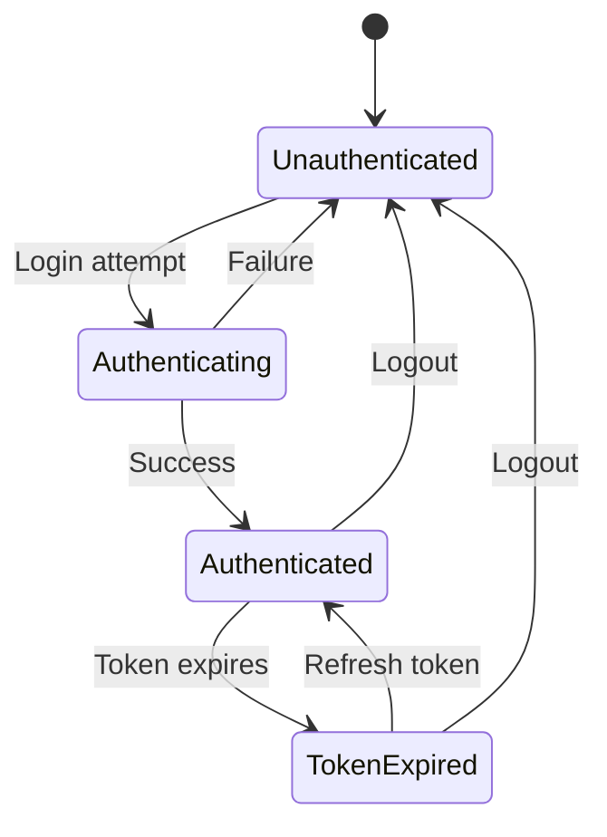
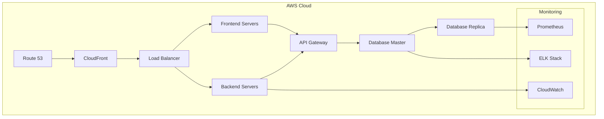
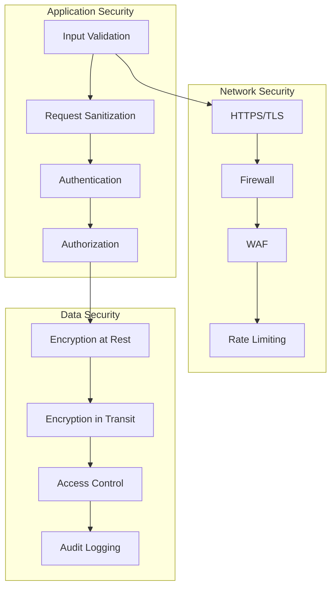

# Project Architecture and UML Diagrams

## System Architecture Overview

### High-Level Architecture


## Component Architecture

### Frontend Components


### Backend Components


## Sequence Diagrams

### User Registration Flow


### User Login Flow


## Use Case Diagrams

### Authentication Use Cases
```mermaid
useCaseDiagram
    actor User
    actor Admin
    actor System

    User --> (Register Account)
    User --> (Login)
    User --> (Logout)
    User --> (Reset Password)
    User --> (Update Profile)
    
    Admin --> (View User List)
    Admin --> (Manage User Accounts)
    Admin --> (View System Logs)
    
    System --> (Validate Credentials)
    System --> (Generate Tokens)
    System --> (Send Emails)
    System --> (Log Activities)
```

## Activity Diagrams

### Authentication Flow
```mermaid
activityDiagram
    start
    :User attempts to access protected resource;
    
    if (Has valid token?) then (yes)
        :Allow access;
    else (no)
        :Redirect to login;
        :User enters credentials;
        
        if (Valid credentials?) then (yes)
            :Generate JWT token;
            :Store token in localStorage;
            :Redirect to requested resource;
        else (no)
            :Show error message;
            :Return to login form;
        endif
    endif
    
    stop
```

### Password Reset Flow
```mermaid
activityDiagram
    start
    :User requests password reset;
    :System generates reset token;
    :Send email with reset link;
    
    :User clicks reset link;
    if (Token valid?) then (yes)
        :Show password reset form;
        :User enters new password;
        :System updates password;
        :Show success message;
    else (no)
        :Show invalid token message;
    endif
    
    stop
```

## State Diagrams

### Authentication State


## Deployment Architecture

### Production Environment


## Security Architecture

### Security Layers
