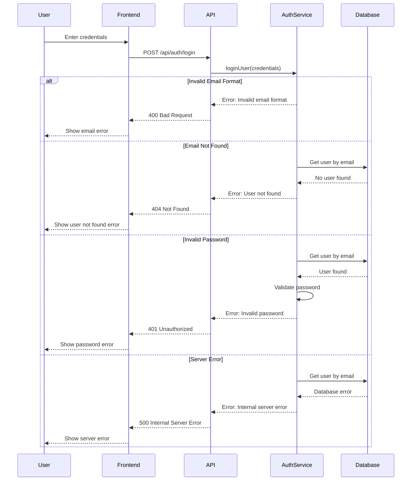
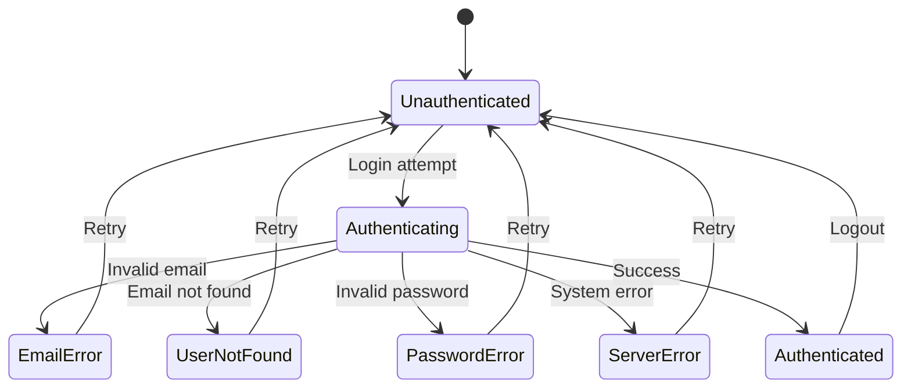
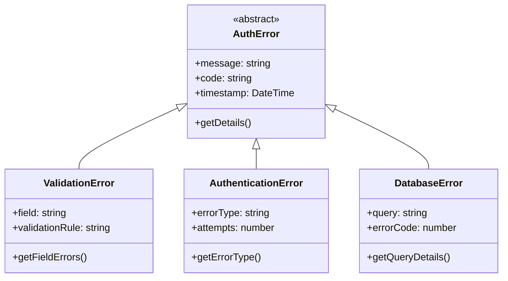
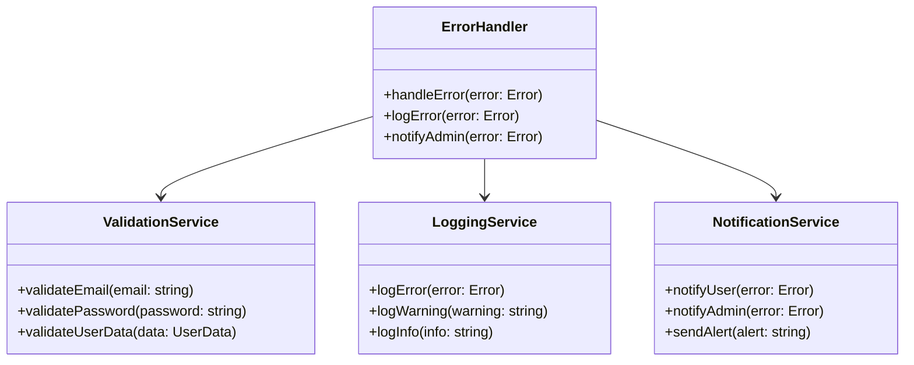
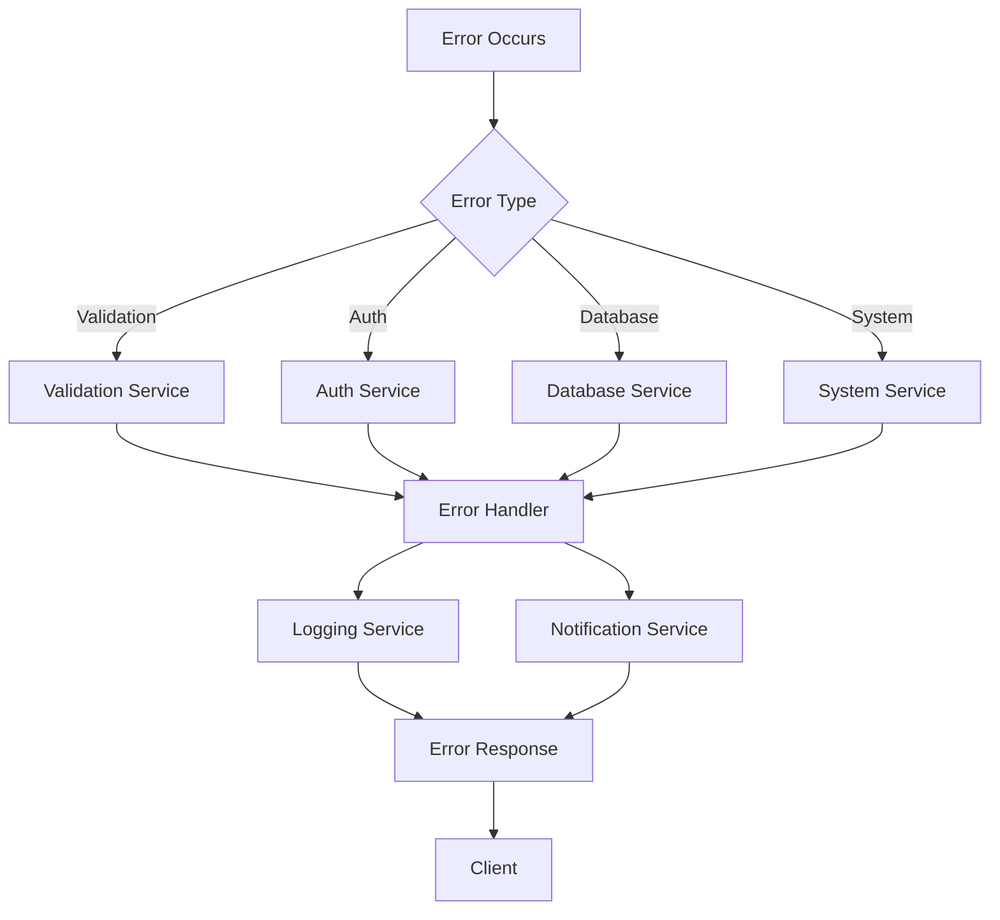

# Error Handling in UML Diagrams

## Sequence Diagram with Error Handling

### Login Error Flow


## Activity Diagram with Error Paths

### Authentication Error Flow
```mermaid
activityDiagram
    start
    :User attempts login;
    
    if (Valid email format?) then (no)
        :Show email format error;
        stop
    else (yes)
        :Check user exists;
    endif
    
    if (User exists?) then (no)
        :Show user not found error;
        stop
    else (yes)
        :Validate password;
    endif
    
    if (Valid password?) then (no)
        :Show invalid password error;
        stop
    else (yes)
        :Generate token;
        try
            :Store token;
        catch (Storage error)
            :Show storage error;
            stop
        end
        :Redirect to dashboard;
    endif
    
    stop
```

## State Diagram with Error States

### Authentication State with Errors


## Class Diagram with Error Classes

### Error Handling Classes


## Use Case Diagram with Error Scenarios

### Authentication Error Use Cases
```mermaid
useCaseDiagram
    actor User
    actor System
    
    User --> (Attempt Login)
    User --> (Handle Login Error)
    User --> (Reset Password)
    User --> (Handle Password Reset Error)
    
    System --> (Validate Input)
    System --> (Check User Exists)
    System --> (Verify Password)
    System --> (Generate Token)
    System --> (Handle Database Error)
    System --> (Handle Network Error)
    
    (Attempt Login) ..> (Validate Input) : <<include>>
    (Attempt Login) ..> (Check User Exists) : <<include>>
    (Attempt Login) ..> (Verify Password) : <<include>>
    (Attempt Login) ..> (Generate Token) : <<include>>
    
    (Handle Login Error) ..> (Handle Database Error) : <<extend>>
    (Handle Login Error) ..> (Handle Network Error) : <<extend>>
```

## Component Diagram with Error Handling Components

### Error Handling Architecture


## Error Response Flow


## Best Practices for Error Handling in UML
1. Always show error paths in sequence diagrams
2. Include error states in state diagrams
3. Document error classes and hierarchies
4. Show error handling components
5. Include error scenarios in use cases
6. Document error response flows
7. Show error recovery paths
8. Include error logging and notification
9. Document error codes and messages
10. Show error handling at system boundaries 