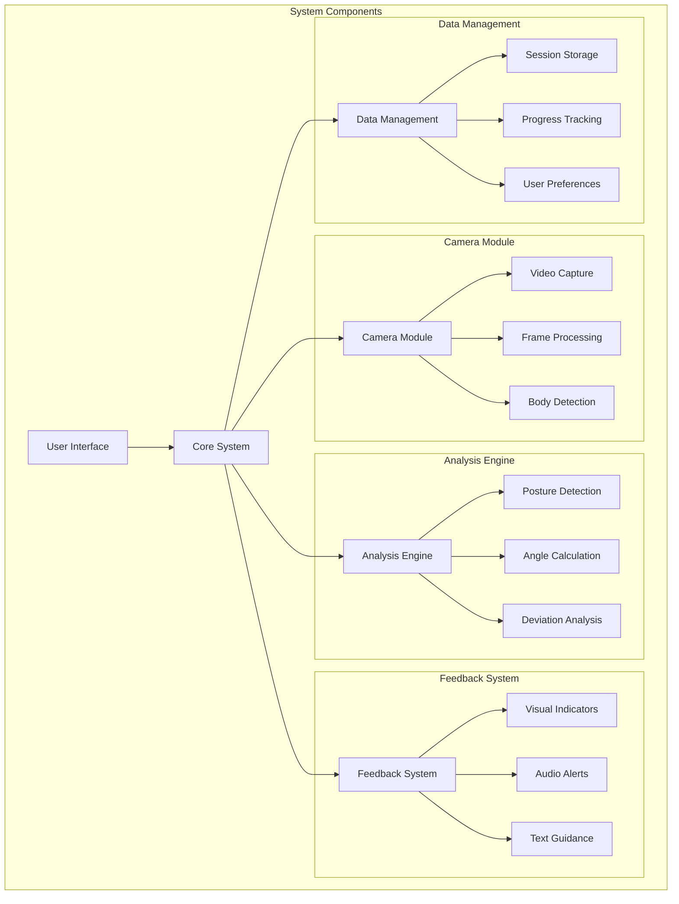
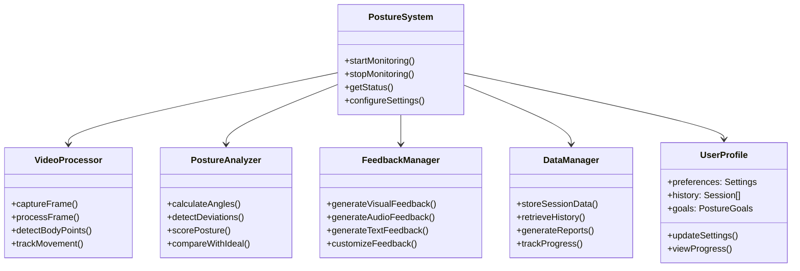
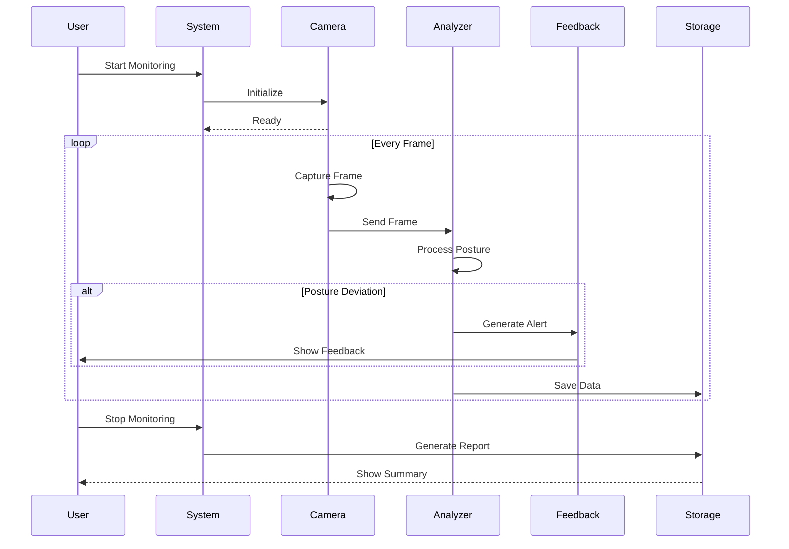
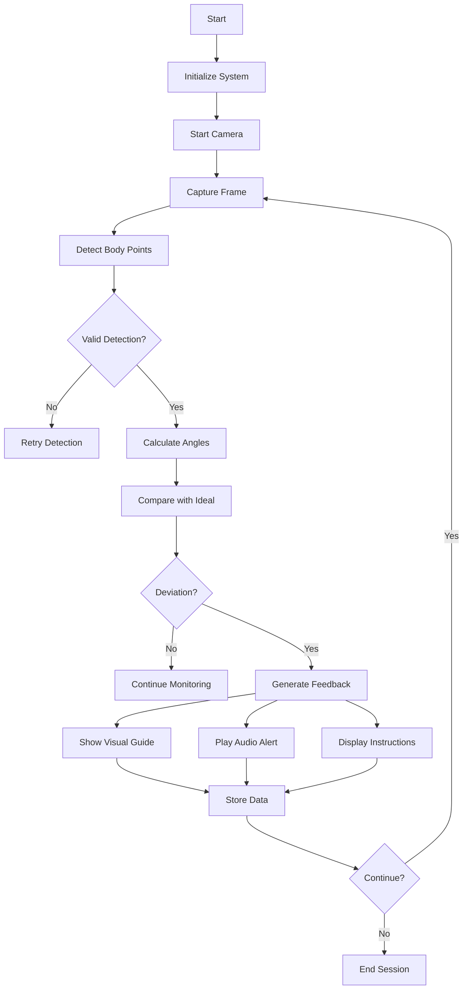
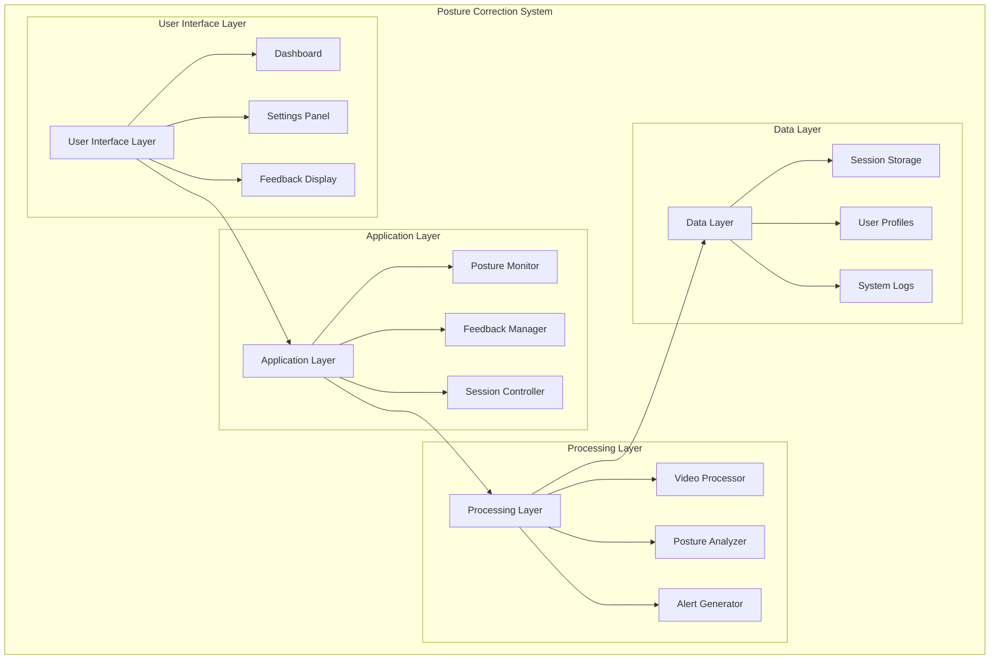

# Adaptive 2D Posture Correction System Architecture

## System Overview
The Adaptive 2D Posture Correction System is a real-time monitoring and feedback system that helps users maintain proper posture. It uses computer vision to track body positions and provides immediate feedback when posture deviations are detected.

## 1. System Architecture

## 2. Use Case Diagram

```mermaid
graph TD
    subgraph "System Actors"
        A[User]
        B[System]
        C[Camera]
        D[Database]
    end

    subgraph "User Interactions"
        A --> E[Start Monitoring]
        A --> F[View Analysis]
        A --> G[Receive Feedback]
        A --> H[Set Preferences]
        A --> I[View History]
    end

    subgraph "System Functions"
        B --> J[Process Video]
        B --> K[Analyze Posture]
        B --> L[Generate Feedback]
        B --> M[Store Data]
    end

    subgraph "Camera Operations"
        C --> N[Capture Video]
        C --> O[Track Body Points]
        C --> P[Detect Movement]
    end

    subgraph "Data Operations"
        D --> Q[Store Sessions]
        D --> R[Track Progress]
        D --> S[Manage Settings]
    end

    style A fill:#f9f,stroke:#333,stroke-width:2px
    style B fill:#bbf,stroke:#333,stroke-width:2px
    style C fill:#bfb,stroke:#333,stroke-width:2px
    style D fill:#fbb,stroke:#333,stroke-width:2px
```

## 3. Class Diagram

## 4. Sequence Diagram - Real-time Monitoring

## 5. Activity Diagram - Posture Analysis Flow

## 6. Component Architecture

## Key Features
1. Real-time posture monitoring
2. Multiple feedback mechanisms (visual, audio, text)
3. Progress tracking and reporting
4. Customizable settings and preferences
5. Historical data analysis
6. Adaptive feedback system

## Technical Requirements
1. Camera with sufficient resolution
2. Processing power for real-time analysis
3. Storage for session data
4. User interface for interaction
5. Feedback mechanisms (display, audio) 