# Project UML Diagrams

## 1. System Overview

### High-Level System Architecture
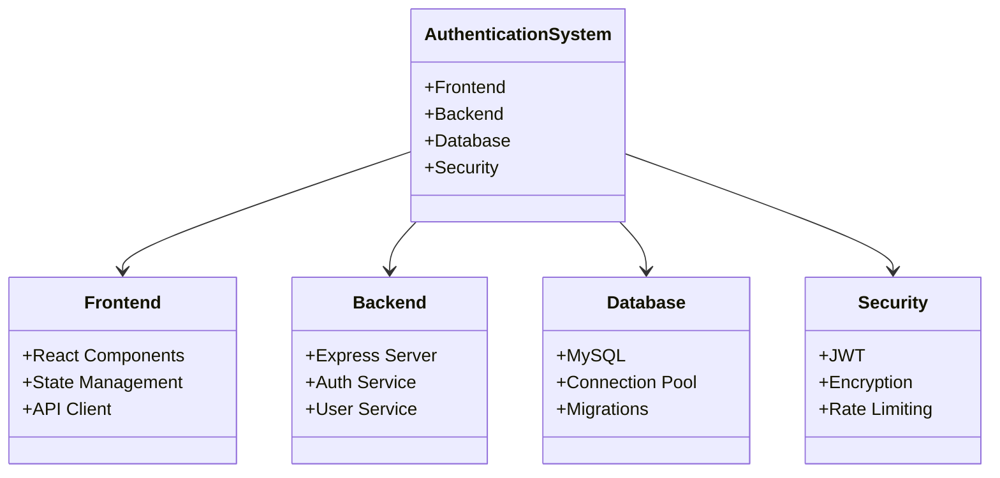

## 2. Frontend Architecture

### Component Structure
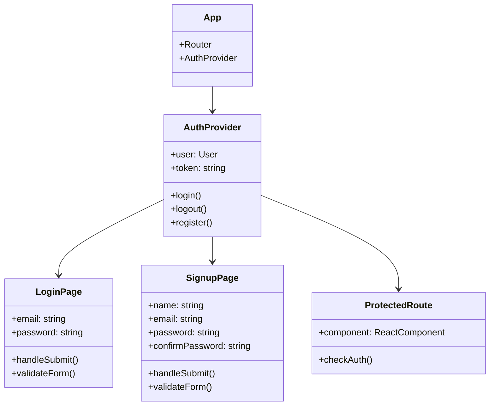

## 3. Backend Architecture

### Service Layer
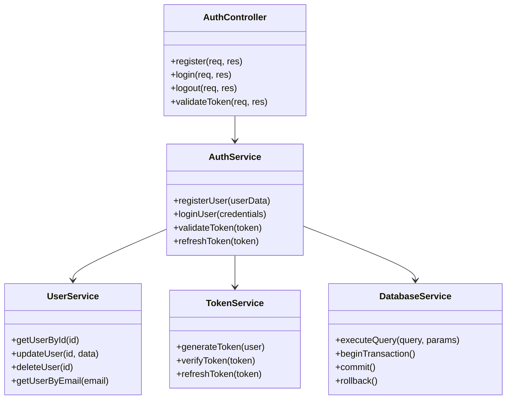

## 4. Database Schema

### Entity Relationship Diagram
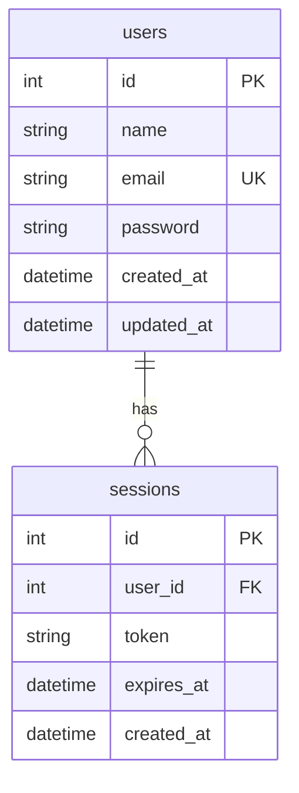

## 5. Authentication Flow

### Login Sequence
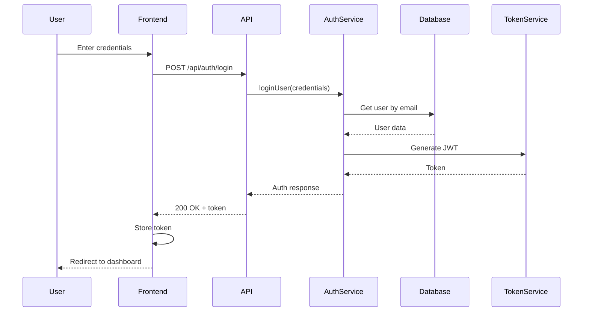

### Registration Sequence
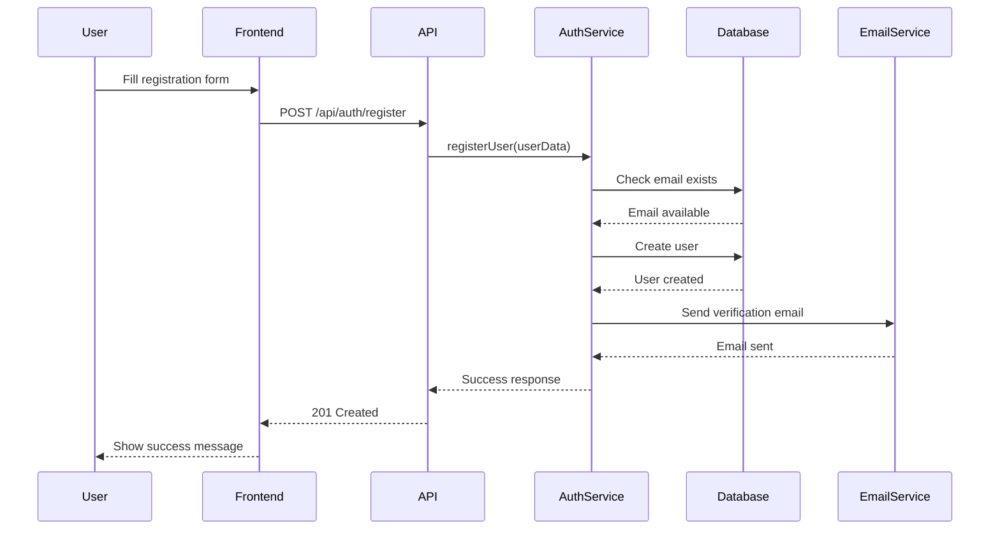

## 6. State Management

### Authentication State
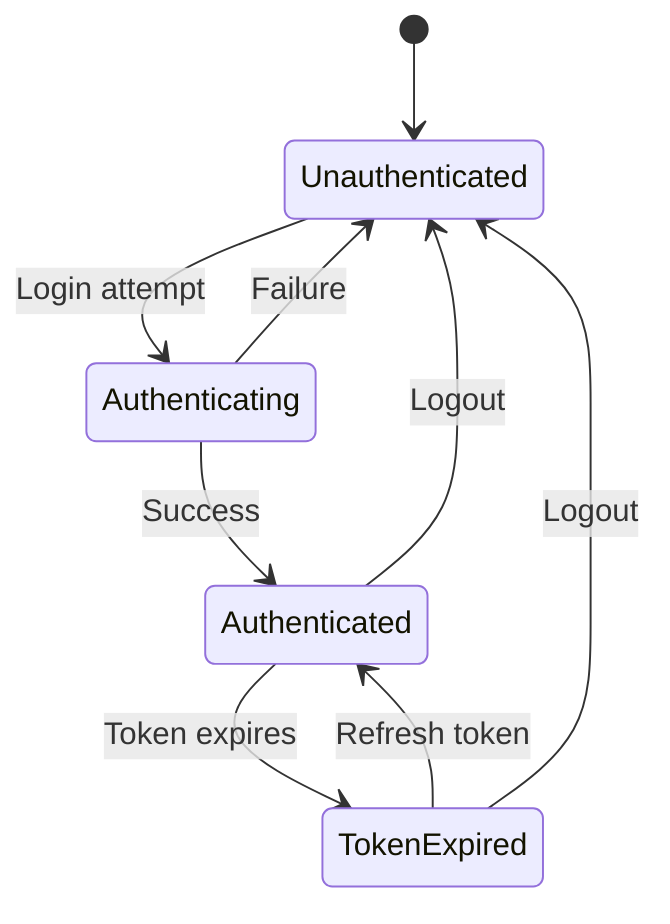

## 7. Use Cases

### Authentication System Use Cases
```mermaid
graph TD
    subgraph Actors
        A[User]
        B[Admin]
        C[System]
    end

    subgraph User Use Cases
        A --> D[Register Account]
        A --> E[Login]
        A --> F[Logout]
        A --> G[Reset Password]
        A --> H[Update Profile]
        A --> I[View Profile]
        A --> J[Change Password]
    end

    subgraph Admin Use Cases
        B --> K[View User List]
        B --> L[Manage User Accounts]
        B --> M[View System Logs]
        B --> N[Block User]
        B --> O[Unblock User]
        B --> P[View User Activity]
    end

    subgraph System Use Cases
        C --> Q[Validate Credentials]
        C --> R[Generate Tokens]
        C --> S[Send Emails]
        C --> T[Log Activities]
        C --> U[Monitor Security]
        C --> V[Backup Data]
    end

    style A fill:#f9f,stroke:#333,stroke-width:2px
    style B fill:#bbf,stroke:#333,stroke-width:2px
    style C fill:#bfb,stroke:#333,stroke-width:2px
```

## 8. Security Architecture

### Security Components
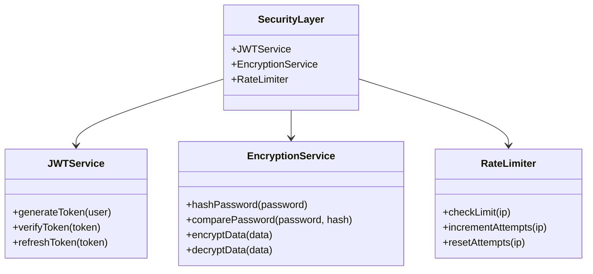

## 9. Error Handling

### Error Class Hierarchy
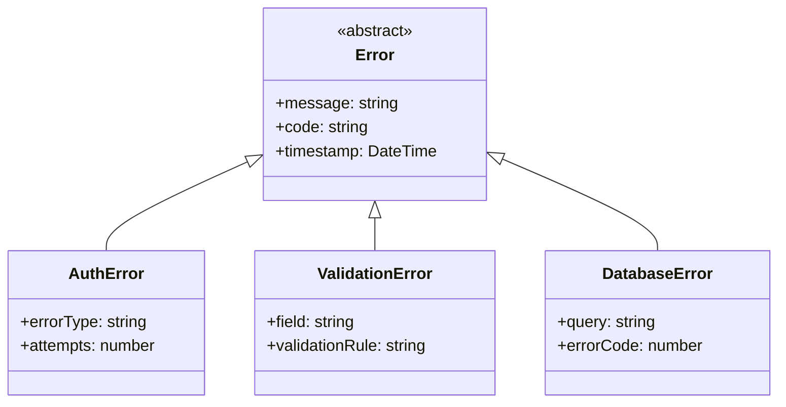

## 10. Deployment Architecture

### Production Environment
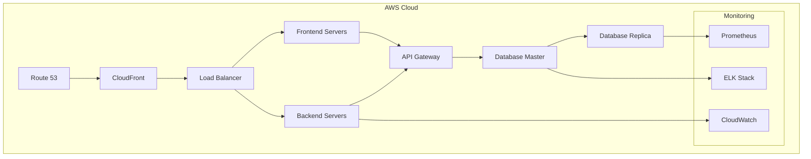

## 2. Class Diagrams

### Core Authentication Classes
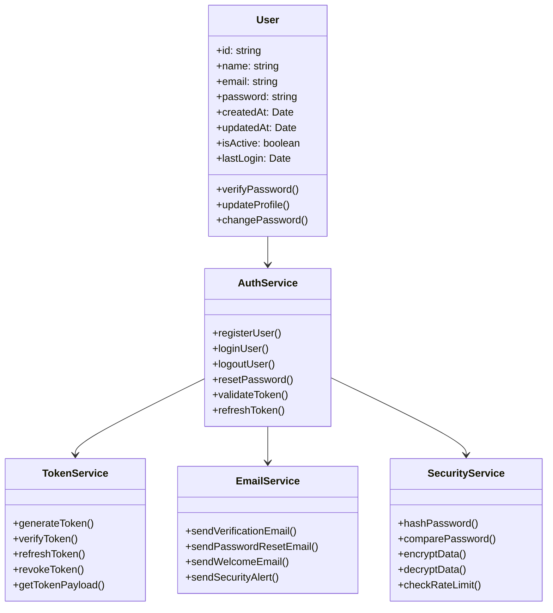

### Frontend Component Classes
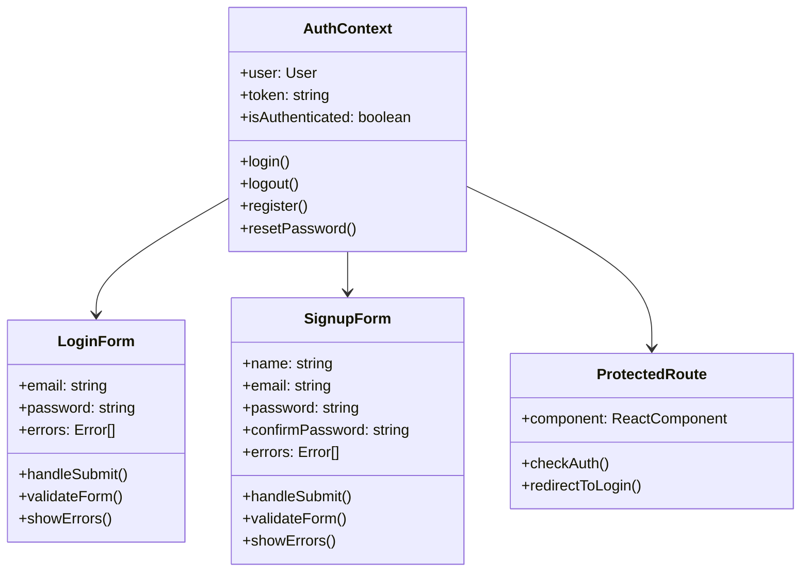

## 3. Sequence Diagrams

### User Registration Flow
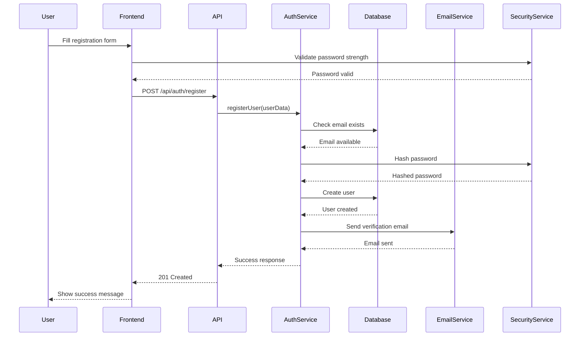

### Password Reset Flow
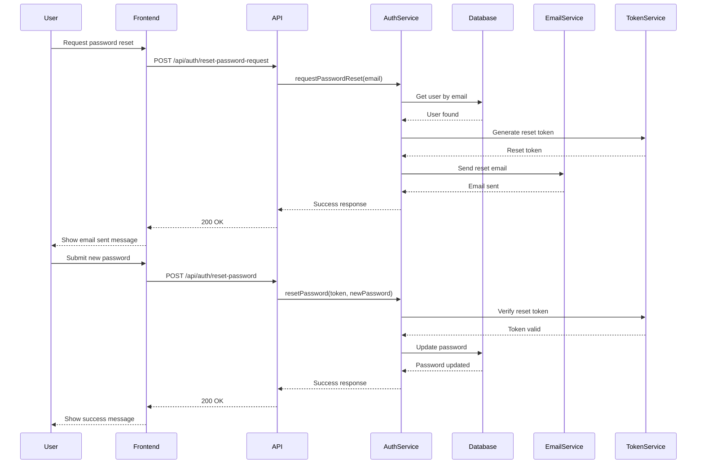

## 4. Activity Diagrams

### User Authentication Flow
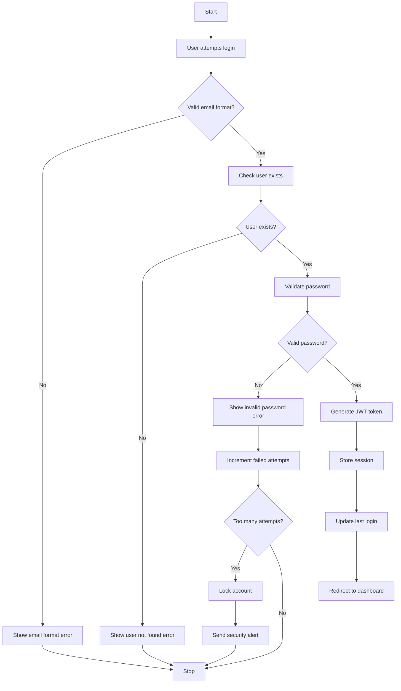

### Account Recovery Flow
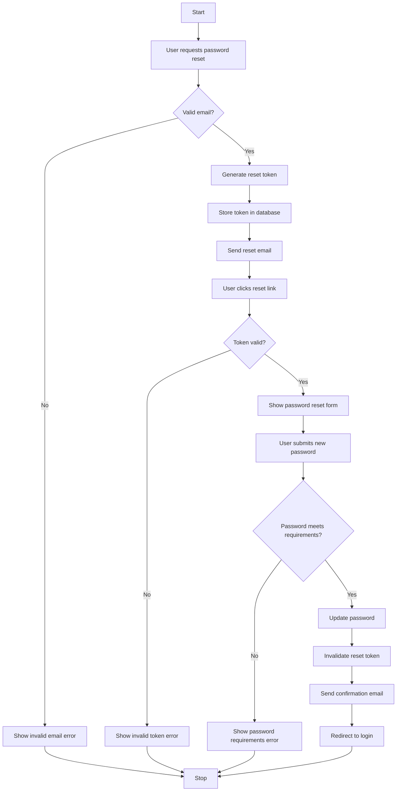