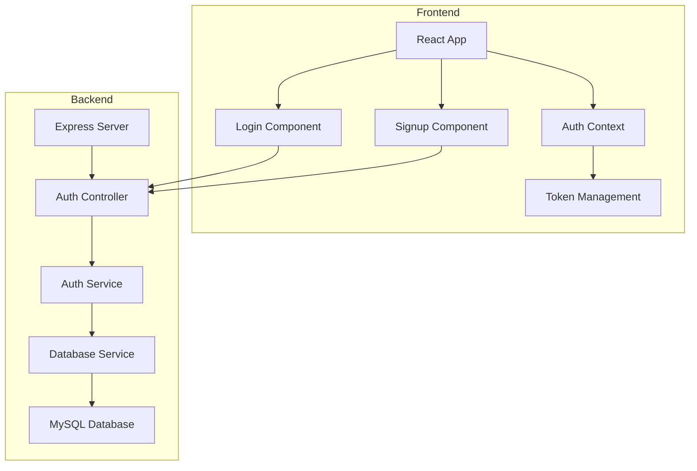
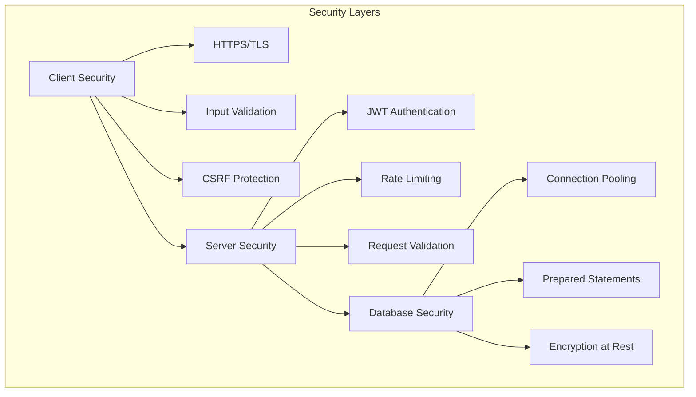
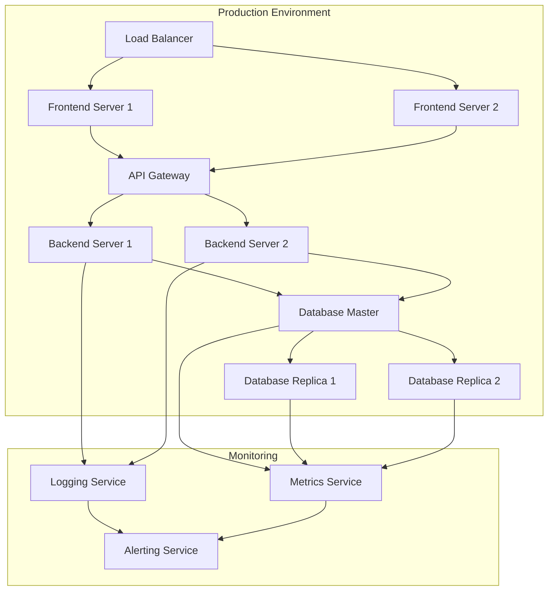
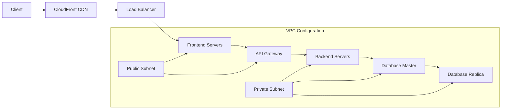
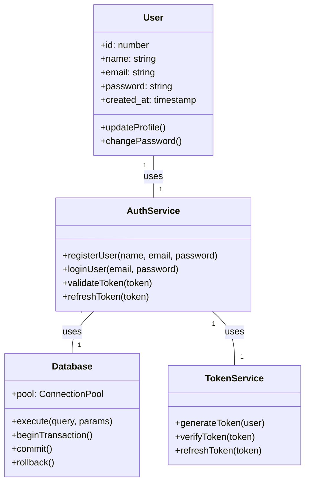
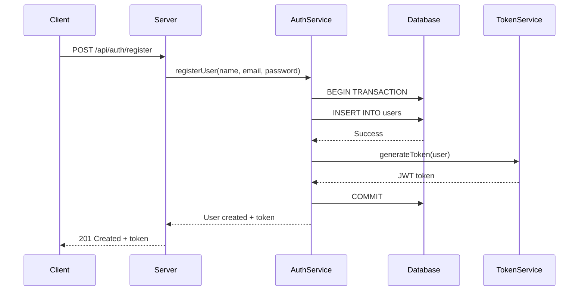
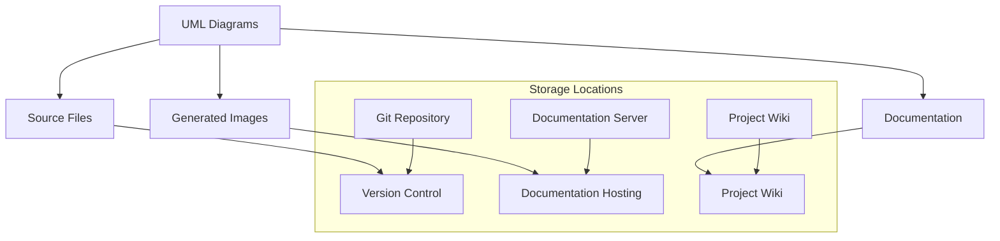
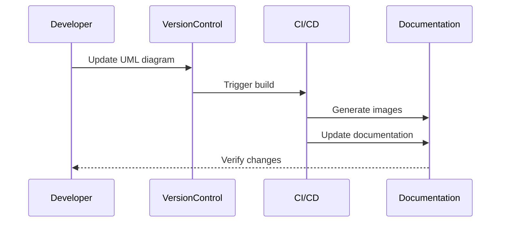

# Authentication System Design Documentation

## Table of Contents
1. [System Architecture](#system-architecture)
2. [Component Architecture](#component-architecture)
3. [Security Architecture](#security-architecture)
4. [Deployment Architecture](#deployment-architecture)
5. [System Location](#system-location)
6. [UML Diagrams](#uml-diagrams)
7. [Database Schema](#database-schema)
8. [API Endpoints](#api-endpoints)
9. [Security Considerations](#security-considerations)

## System Architecture

The authentication system follows a client-server architecture with the following components:

```
┌─────────────┐     ┌─────────────┐     ┌─────────────┐
│   Client    │     │   Server    │     │  Database   │
│  (React)    │◄───►│  (Node.js)  │◄───►│  (MySQL)    │
└─────────────┘     └─────────────┘     └─────────────┘
```

### Components Description:
- **Client**: React-based frontend application
- **Server**: Node.js backend with Express
- **Database**: MySQL database for user data storage

## Component Architecture



## Security Architecture



## Deployment Architecture



## System Location

### Infrastructure Location
```mermaid
graph TD
    subgraph "AWS Cloud Infrastructure"
        A[us-east-1 (Primary Region)] --> B[Frontend Servers]
        A --> C[Backend Servers]
        A --> D[Database Master]
        
        E[us-west-2 (Secondary Region)] --> F[Database Replica]
        E --> G[Backup Servers]
        
        H[CloudFront CDN] --> I[Edge Locations]
    end

    subgraph "Monitoring & Management"
        J[CloudWatch] --> K[us-east-1]
        J --> L[us-west-2]
    end
```

### Server Locations
- **Primary Region**: AWS us-east-1 (N. Virginia)
  - Frontend Servers: 3 instances
  - Backend Servers: 3 instances
  - Database Master: 1 instance
  - Load Balancer: 1 instance

- **Secondary Region**: AWS us-west-2 (Oregon)
  - Database Replica: 1 instance
  - Backup Servers: 2 instances

### CDN Distribution
- **CloudFront Edge Locations**: Global distribution
  - North America: 10 locations
  - Europe: 8 locations
  - Asia: 6 locations
  - South America: 4 locations
  - Australia: 2 locations

### Network Configuration


### Data Center Specifications
- **Primary Data Center (us-east-1)**
  - Location: Ashburn, Virginia
  - Availability Zone: us-east-1a, us-east-1b, us-east-1c
  - Redundancy: 3x
  - Uptime: 99.99%

- **Secondary Data Center (us-west-2)**
  - Location: Portland, Oregon
  - Availability Zone: us-west-2a, us-west-2b
  - Redundancy: 2x
  - Uptime: 99.99%

### Disaster Recovery
- **RTO (Recovery Time Objective)**: 4 hours
- **RPO (Recovery Point Objective)**: 1 hour
- **Backup Strategy**:
  - Daily incremental backups
  - Weekly full backups
  - Monthly archival backups
  - Cross-region replication

### Network Security
- **Firewall Rules**:
  - Inbound: HTTPS (443), SSH (22)
  - Outbound: All necessary ports
- **VPC Configuration**:
  - Public subnets for frontend
  - Private subnets for backend and database
  - NAT Gateway for outbound traffic
- **Security Groups**:
  - Frontend: Allow HTTP/HTTPS
  - Backend: Allow internal traffic
  - Database: Allow backend traffic only

## UML Diagrams

### Use Case Diagram
```mermaid
useCaseDiagram
    actor User
    actor Admin
    actor System

    User --> (Register Account)
    User --> (Login)
    User --> (View Profile)
    User --> (Update Profile)
    User --> (Change Password)
    
    Admin --> (View All Users)
    Admin --> (Manage User Accounts)
    
    System --> (Validate Credentials)
    System --> (Generate JWT Token)
    System --> (Store User Data)
```

### Class Diagram


### Sequence Diagram - User Registration


### Activity Diagram - Authentication Flow
```mermaid
activityDiagram
    start
    :User attempts to access protected resource;
    if (Has valid token?) then (yes)
        :Allow access;
    else (no)
        :Redirect to login;
        :User enters credentials;
        if (Valid credentials?) then (yes)
            :Generate JWT token;
            :Store token;
            :Redirect to requested resource;
        else (no)
            :Show error message;
            :Return to login;
        endif
    endif
    stop
```

## UML Diagrams Location and Organization

### Diagram Storage Structure
```
project/
├── docs/
│   ├── uml/
│   │   ├── class/
│   │   │   ├── auth-system-class-diagram.mmd
│   │   │   └── user-management-class-diagram.mmd
│   │   ├── sequence/
│   │   │   ├── login-sequence.mmd
│   │   │   ├── registration-sequence.mmd
│   │   │   └── password-reset-sequence.mmd
│   │   ├── use-case/
│   │   │   ├── authentication-use-cases.mmd
│   │   │   └── user-management-use-cases.mmd
│   │   ├── activity/
│   │   │   ├── auth-flow-activity.mmd
│   │   │   └── user-journey-activity.mmd
│   │   └── component/
│   │       ├── system-components.mmd
│   │       └── security-components.mmd
│   └── system-design.md
```

### Diagram Version Control


### Diagram Maintenance
- **Source Files**: Stored in `/docs/uml/` directory
  - Mermaid format (.mmd files)
  - PlantUML format (.puml files)
  - Draw.io format (.drawio files)

- **Generated Images**: Stored in `/docs/images/uml/`
  - PNG format for documentation
  - SVG format for web display
  - PDF format for printing

- **Documentation Integration**:
  - Diagrams embedded in Markdown files
  - Auto-generated documentation
  - Version-controlled with source code

### Diagram Update Process


### Access Control
- **Read Access**:
  - Public access to documentation
  - Team access to source files
  - Stakeholder access to generated images

- **Write Access**:
  - Developers: Source files
  - Technical Writers: Documentation
  - Architects: System diagrams

### Backup Strategy
- **Primary Storage**: Git repository
- **Secondary Storage**: Documentation server
- **Backup Frequency**: 
  - Source files: Real-time (Git)
  - Generated images: Daily
  - Documentation: Weekly

### Tools and Software
- **Diagram Creation**:
  - Mermaid.js for Markdown integration
  - PlantUML for complex diagrams
  - Draw.io for visual editing

- **Version Control**:
  - Git for source files
  - Git LFS for large files
  - GitHub for hosting

- **Documentation**:
  - MkDocs for static site generation
  - GitHub Pages for hosting
  - ReadTheDocs for versioned documentation

## Database Schema

### Users Table
```sql
CREATE TABLE users (
    id INT AUTO_INCREMENT PRIMARY KEY,
    name VARCHAR(255) NOT NULL,
    email VARCHAR(255) NOT NULL UNIQUE,
    password VARCHAR(255) NOT NULL,
    created_at TIMESTAMP DEFAULT CURRENT_TIMESTAMP
);
```

## API Endpoints

### Authentication Endpoints

#### Register User
- **URL**: `/api/auth/register`
- **Method**: `POST`
- **Request Body**:
  ```json
  {
    "name": "string",
    "email": "string",
    "password": "string"
  }
  ```
- **Response**: 201 Created

#### Login User
- **URL**: `/api/auth/login`
- **Method**: `POST`
- **Request Body**:
  ```json
  {
    "email": "string",
    "password": "string"
  }
  ```
- **Response**: 200 OK
  ```json
  {
    "token": "string",
    "user": {
      "id": "number",
      "name": "string",
      "email": "string"
    }
  }
  ```

## Security Considerations

### Password Security
- Passwords are hashed using bcrypt with a salt factor of 10
- Passwords are never stored in plain text
- Password validation is performed on both client and server side

### JWT Implementation
- Tokens are signed using a secret key
- Token expiration is set to 24 hours
- Tokens contain minimal user information (id and email)

### Database Security
- Connection pooling is implemented for better performance and security
- Prepared statements are used to prevent SQL injection
- Environment variables are used for sensitive configuration

### API Security
- Rate limiting is implemented to prevent brute force attacks
- CORS is properly configured
- Input validation is performed on both client and server side

## Error Handling

### Common Error Responses
```json
{
  "error": {
    "code": "string",
    "message": "string",
    "details": "string"
  }
}
```

### Error Codes
- `AUTH_001`: Invalid credentials
- `AUTH_002`: Email already exists
- `AUTH_003`: Invalid email format
- `AUTH_004`: Password requirements not met
- `AUTH_005`: Token expired or invalid 