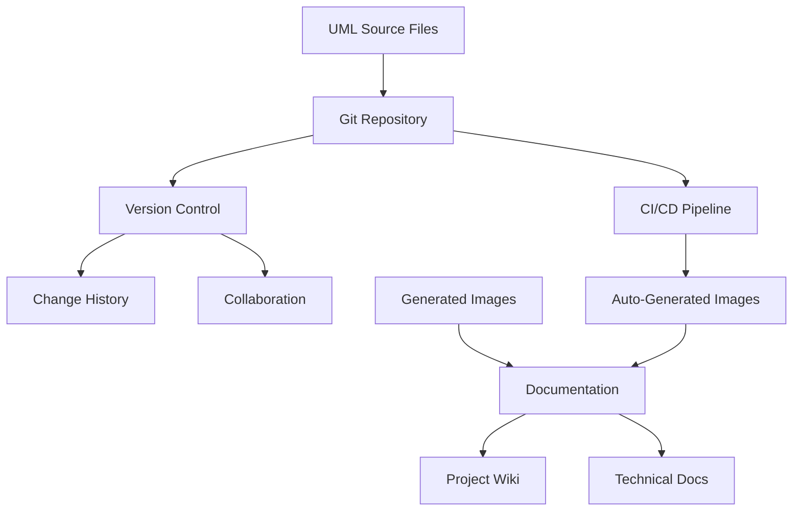
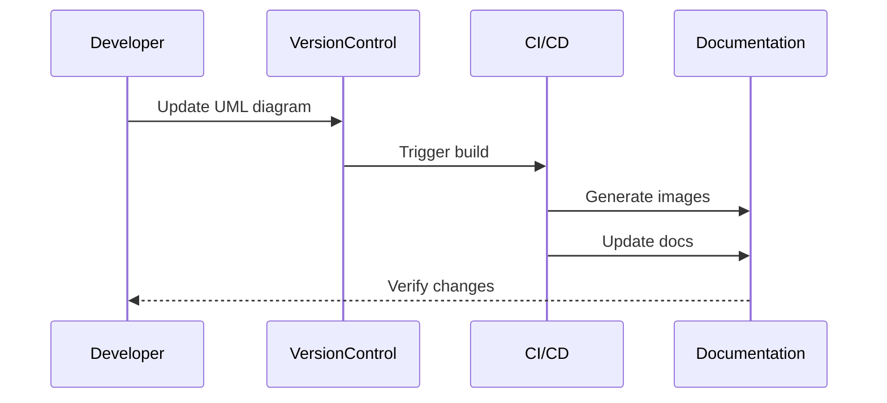
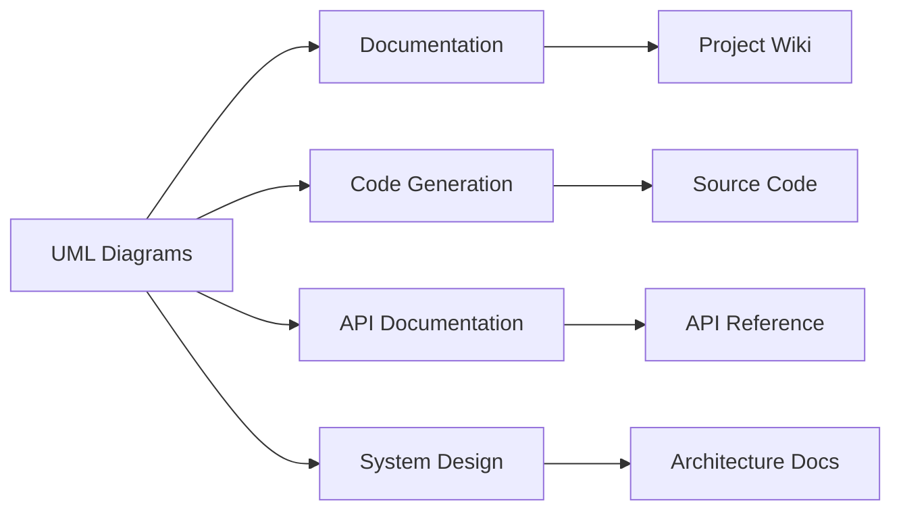

# UML Diagrams Location and Organization

## Directory Structure
```
project/
├── docs/
│   ├── uml/
│   │   ├── class/
│   │   │   ├── auth-system-class-diagram.mmd
│   │   │   ├── user-management-class-diagram.mmd
│   │   │   └── database-class-diagram.mmd
│   │   ├── sequence/
│   │   │   ├── login-sequence.mmd
│   │   │   ├── registration-sequence.mmd
│   │   │   ├── password-reset-sequence.mmd
│   │   │   └── token-refresh-sequence.mmd
│   │   ├── use-case/
│   │   │   ├── authentication-use-cases.mmd
│   │   │   ├── user-management-use-cases.mmd
│   │   │   └── admin-use-cases.mmd
│   │   ├── activity/
│   │   │   ├── auth-flow-activity.mmd
│   │   │   ├── user-journey-activity.mmd
│   │   │   └── password-reset-activity.mmd
│   │   ├── state/
│   │   │   ├── auth-state-diagram.mmd
│   │   │   └── token-state-diagram.mmd
│   │   └── component/
│   │       ├── frontend-components.mmd
│   │       ├── backend-components.mmd
│   │       └── system-components.mmd
│   ├── images/
│   │   └── uml/
│   │       ├── class/
│   │       ├── sequence/
│   │       ├── use-case/
│   │       ├── activity/
│   │       ├── state/
│   │       └── component/
│   └── architecture-diagrams.md
```

## File Naming Convention
- **Class Diagrams**: `{system}-class-diagram.mmd`
- **Sequence Diagrams**: `{process}-sequence.mmd`
- **Use Case Diagrams**: `{feature}-use-cases.mmd`
- **Activity Diagrams**: `{process}-activity.mmd`
- **State Diagrams**: `{entity}-state-diagram.mmd`
- **Component Diagrams**: `{layer}-components.mmd`

## Version Control


## Access and Permissions
- **Source Files** (`/docs/uml/`):
  - Developers: Read/Write
  - Architects: Read/Write
  - Technical Writers: Read/Write
  - Other Team Members: Read

- **Generated Images** (`/docs/images/uml/`):
  - All Team Members: Read
  - CI/CD Pipeline: Write
  - Documentation System: Read

## Update Process


## Tools and Software
- **Diagram Creation**:
  - Mermaid.js for Markdown integration
  - PlantUML for complex diagrams
  - Draw.io for visual editing

- **Version Control**:
  - Git for source files
  - Git LFS for large files
  - GitHub for hosting

- **Documentation**:
  - MkDocs for static site generation
  - GitHub Pages for hosting
  - ReadTheDocs for versioned documentation

## Backup Strategy
- **Primary Storage**: Git repository
- **Secondary Storage**: Documentation server
- **Backup Frequency**:
  - Source files: Real-time (Git)
  - Generated images: Daily
  - Documentation: Weekly

## Integration Points


## Maintenance Guidelines
1. Keep diagrams up-to-date with code changes
2. Use consistent naming conventions
3. Include version information in diagram files
4. Document any assumptions or constraints
5. Review diagrams during code reviews
6. Update documentation when diagrams change

## Best Practices
- Use consistent styling across all diagrams
- Include proper documentation in diagram files
- Keep diagrams focused and readable
- Use appropriate diagram types for different purposes
- Maintain version history of significant changes
- Include error handling in sequence diagrams
- Document state transitions clearly
- Keep use cases focused on user goals 